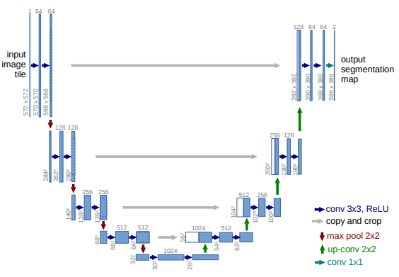
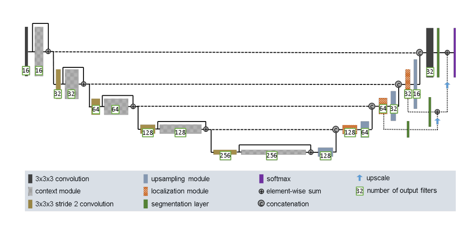
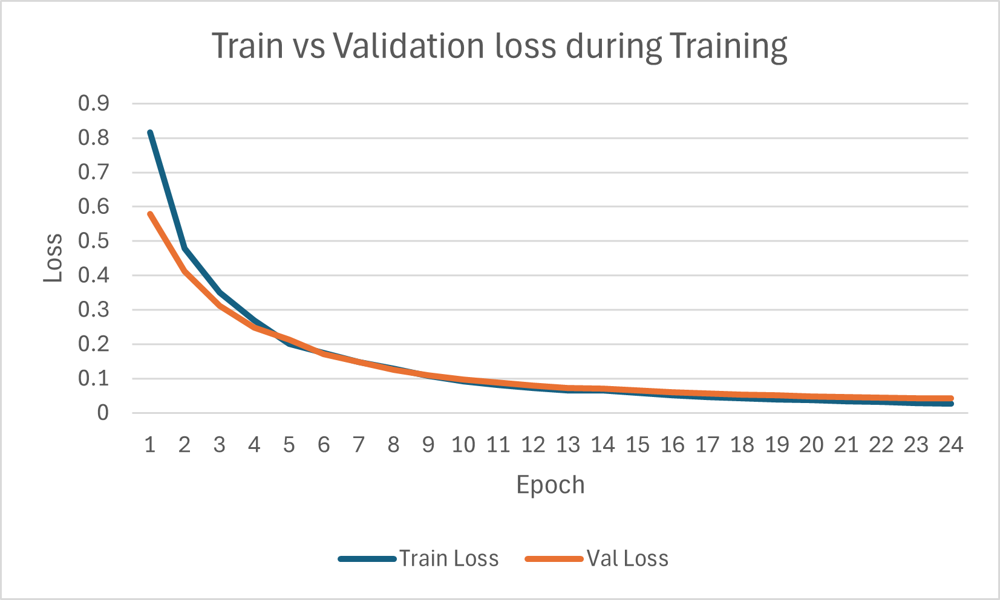
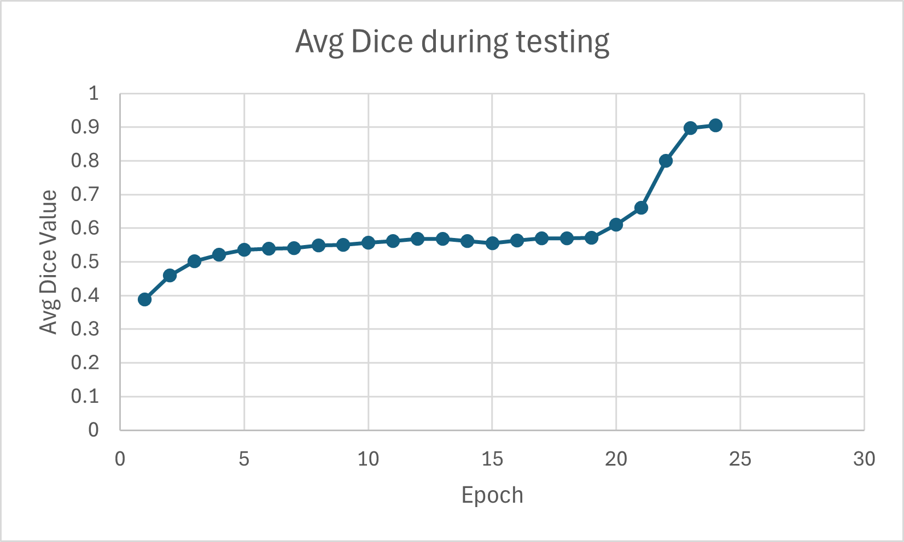
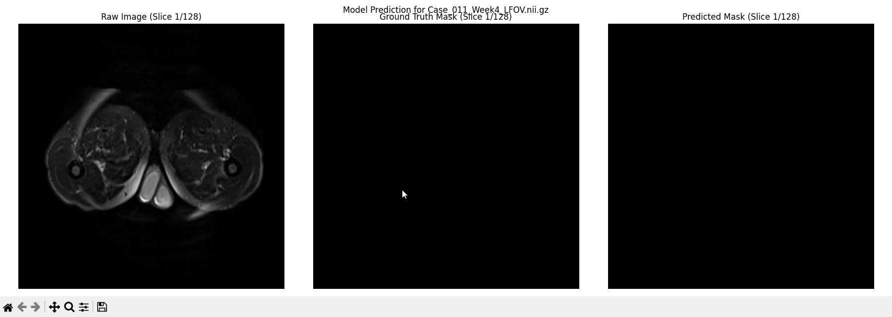

# 3D Prostate Segmentation using UNet Architectures

**Problem: Task 7 - Segmenting Prostate 3D data set.**

**Author: Alan Ravikumar - 45274008**

## Table of Contents
1. [Overview](#1-overview)
2. [Dependences](#2-dependences)
3. [Project Structure](#3-project-structure)
4. [Model and Data](#4-model-and-data)
5. [Implementation](#5-implementation)
6. [Results](#6-results)
7. [Future Work](#7-future-work)
8. [Reference](#8-reference)

### 1. Overview: Problem and Algorithm

The Problem

This project tackles the challenge of volumetric medical image segmentation. The goal is to take a 3D MRI scan of a prostate and automatically generate an accurate segmentation mask that identifies different classes of tissue (6 classes in total, including background and 5 distinct foreground regions). Automated segmentation is critical for streamlining clinical workflows, aiding in diagnosis, and planning treatments.

### 2. Dependences

This project was constructed with the following key dependencies:

* **Python 3.x**: Core programming language.
* **PyTorch**: Deep learning framework for training and evaluation of models.
* **NumPy**: Numerical computation and array operations.
* **nibabel**: For loading and handling NIfTI (`.nii.gz`) medical image files.
* **matplotlib**: For plotting training history and visualizing 2D/3D image slices.
* **scikit-learn**: For data splitting (`train_test_split`) and performance metrics.
* **tqdm**: To display progress bars during training and evaluation.
* **argparse**: For model selection via command line for training.

#### 2.1 Installation

The main dependencies can be installed via `pip`. It is **highly recommended** to install PyTorch from the [official website](https://pytorch.org/get-started/locally/) first to ensure you get the correct version with GPU (CUDA) support for your system.

```bash
pip install numpy nibabel matplotlib scikit-learn tqdm
```

### 3. Project Structure

The project consists of the following files:

* `modules.py`: Contains the PyTorch class definitions for both the baseline `UNet3D` and the `ImprovedUNet3D`, along with their respective building blocks (`DoubleConv`, `ImprovedConvBlock`, etc.).
* `dataset.py`: Contains the `ProstateDataset` class, a custom PyTorch `Dataset` that loads, pre-processes, and serves 3D NIfTI files for the `DataLoader`.
* `train.py`: The main training script. It handles data splitting, model initialization (Standard or Improved), the training/validation loop, and saving the best-performing model based on validation Dice score.
* `predict.py`: The evaluation and visualization script. It loads a trained model, runs it on the entire validation set to calculate the final average and per-class Dice scores, and then provides a 3D slice-by-slice visualization of a sample prediction.

#### 3.1 Running code

You can run the project using the main scripts. Ensure your `images` folder (containing `semantic_MRs_anon` and `semantic_labels_anon`) is in the same directory.

**2. Train a model:**
Run `train.py` to start training. You can use the `-m` argument to choose between the standard 'unet' and the 'improved' unet.

```
# Train the "Hard Difficulty" Improved UNet (default)
python train.py -m improved_unet

# Train the "Normal Difficulty" Standard UNet
python train.py -m unet

```

This will save the best model (e.g., `3d_unet_prostate_slim_improved.pth`) in the root directory.

**3. Evaluate and Predict:**
Run `predict.py` to see the results. Make sure the `MODEL_SAVE_PATH` variable in the script matches the model you trained. Use the `-m` argument to choose between the standard 'unet' and the 'improved' unet.

```
# Test the "Hard Difficulty" Improved UNet (default)
python predict.py -m improved_unet

# Test the "Normal Difficulty" Standard UNet
python predict.py -m unet
```

This will print the final Dice scores and launch the 3D visualization.

### 4. Model and Data

#### 4.1 Model Architectures

UNet is a type of convolutional model that is used for image segementation mainly used in the medical field to seperate problems, such as tumours, from healthy parts of the body [2]. The model gets its name from the fact its architecture is in a U-shape.



The architecture has encoder on path and a decoder path. The encoder path follows a typical convolutional network, it consists of applying two 3x3 unpadded convolution followed by a `ReLU` and 2x2 max pooling of stride 2 for downsampling. In the decoder path, it consists of a 2x2 up-convolution concatenated with the corresponding feature map from the encoder path. It is then followed by two 3x3 convolutions and a `ReLU`. In the final layer a 1x1 convolution is used to map the deature vector into the desired number of classes. [1]



Improved 3D UNet builds on this foundation. This implementation [3] integrates key architectural upgrades to improve training stability and performance. The standard convolutional blocks are replaced with **pre-activation residual blocks** to improve gradient flow. Furthermore, it substitutes `BatchNorm3d` with **`InstanceNorm3d`**, and replaces all `ReLU` activations with **`LeakyReLU`** to prevent the "dying ReLU" problem. The "pre-activation" residual block changes the order of operations within the block to improve the flow of gradients, which makes training deep networks much easier and more stable. It performs the **`InstanceNorm3d`** and **`LeakyReLU`** before convolution.

| Feature | Standard 3D UNet (Baseline) | Improved 3D UNet (Implementation) |
| :--- | :--- | :--- |
| **Conv Block** | **`DoubleConv`** | **`ImprovedConvBlock` (Residual)** |
| **Logic** | `(Conv -> BN -> ReLU) * 2` | `((IN -> LReLU -> Conv) * 2) + Shortcut` |
| **Normalization** | `BatchNorm3d` | `InstanceNorm3d` |
| **Activation** | `ReLU` | `LeakyReLU` |
| **Key Benefit** | Simple and foundational. | **Residual connections** improve gradient flow. **Instance Norm** is crucial. **Leaky ReLU** prevents "dying" neurons. |

#### 4.2 The Dataset
The dataset being used is the (downsampled) Prostate 3D dataset provided for the project, consisting of 211 3D NIfTI volumes. Each volume includes a semantic_MRs_anon (MRI scan) and a corresponding semantic_labels_anon (6-class segmentation mask). This has real world application and possibility to help doctors and medical professionals help diagnose and treat cancer and diseases.

### 5. Implementation

**DISCLAMIER:** These models were run on a GTX1080 8Gb, because of the limited memory the models and training were limited. To maximise performance on your setup, for more modern and powerful GPUs, adjust **`BATCH_SIZE`** and **`BASE_FEATURES`** in train.py accordingly.

#### 5.1 Modules and Training
Several key implementation details were critical to solving the task, particularly given the memory constraints of 3D data.

* **Memory Management:** Initial testing with `BATCH_SIZE=5` and `BASE_FEATURES=64` (or even 32) resulted in `OutOfMemoryError` on an 8GB GPU. Instead of downsampling the data (which loses resolution), the model itself was made "slimmer" by setting **`BASE_FEATURES=16`** and **`BATCH_SIZE=1`** in `train.py`. This significantly reduced the model's memory footprint and allowed training to complete on the full-resolution data.

* **Normalization Choice:** The `ImprovedUNet3D` uses **`InstanceNorm3d`**. This was a vital change from the baseline's `BatchNorm3d`. `BatchNorm3d` fails to compute meaningful statistics with `BATCH_SIZE=1`, while `InstanceNorm3d` is independent of the batch size and is standard practice for modern segmentation models.

* **Loss Function:** A standard `nn.CrossEntropyLoss` was used. This is effective for multi-class segmentation.

* **Evaluation Metric:** The primary metric is the **Dice Similarity Coefficient (DSC)**, as required by the project. The `dice_metric_per_class` function in `predict.py` calculates this score for each foreground class (1-5) and averages them.

* **Post-Activation Residual Blocks:** Due to time constraints pre-activation residual blocks were not implemented and opted to stay with post-activation version.

#### 5.2 Dataset
**Pre-processing**
The pre-processing pipeline in `dataset.py` is lightweight:
1.  **Load Data:** `nibabel` is used to load the `.nii.gz` files.
2.  **Type Conversion:** Image data is converted to `np.float32` and mask data to `np.int64`.
3.  **Transpose:** The NIfTI volumes are loaded in `(W, H, D)` (Width, Height, Depth) format. They are transposed to `(C, D, H, W)` (Channel, Depth, Height, Width), which is the format PyTorch's `nn.Conv3d` expects.
4.  **Batching:** A `DataLoader` handles batching (with `BATCH_SIZE=1` to fit on an 8GB GPU).

**Data Split**
The dataset of 211 volumes was split into:
* **Training Set: 80% (168 volumes)**
* **Validation Set: 20% (43 volumes)**

This split was performed using `sklearn.model_selection.train_test_split`. An 80/20 split is a standard and robust ratio, providing a large dataset for the model to learn from while reserving a statistically significant portion for unbiased validation.

**Reproducibility:** A `RANDOM_SEED=42` was used for the split, ensuring that the training and validation sets are identical every time the script is run, making the results fully reproducible.


### 6. Results
#### 6.1 Model Performance

The "Improved 3D UNet" (with `base_features=16`) was trained for 50 epochs.

The final model achieved an **Average Dice Score of 0.9069** on the 20% validation set (43 unseen volumes).
The per-class performance was as follows:

| Class | Average Dice Score |
| :---: | :---: |
| 1 | 0.9538 |
| 2 | 0.9168 |
| 3 | 0.8875 |
| 4 | 0.8291 |
| 5 | 0.9474 |

This shows the model is extremely effective at segmenting Class 1 and Class 5, and performs very well on all other foreground classes.

#### 6.2 Training History

Initial experiments with the standard 3D UNet were used to establish the training pipeline, but detailed logs were not saved. Although the standard also had an average dice score in the low 0.9s. Training the standard model took approximately 28 hours for around 40 epochs. The final training run was conducted with the "Improved 3D UNet" due to its superior architecture. The training and validation loss, along with the validation Dice score, were plotted over 24 epochs.





The graph is clearly shows a steady decrease in loss for both the training and testing test. From epochs 18 to 24, the testing loss is higher than the training loss, this shows the model is starting to overfit at this stage. Another important thing to note is, to train this model for 24 epochs it approximately took 19 hours. Showing the improved model is easier and faster to train whlist also producing result on par or greater than the standard UNet.



### 7. Future Work
For future work some topic and changes that can be explored are:

* **Data Augmentation:** The project prompt mentions data augmentation. Implementing 3D-specific augmentations (e.g., random rotations, scaling, elastic deformations) in the `ProstateDataset` class would likely improve model generalization and could push the Dice score even higher.

* **Dice Loss:** The model currently trains with `CrossEntropyLoss`. Adding a `DiceLoss` (or a combined `Dice + CE` loss) could directly optimize the metric that the model is being evaluated on, potentially improving results.

* **Hyperparameter Tuning:** Further tuning of learning rate, optimizer, and `BASE_FEATURES`, especially, could yield performance gains.

* **Pre-Activation Residual Blocks:** Implement pre-activation residual blocks to follow the change in order of operations performed.

* **Increased Dataset Size:** Training and testing on a larger dataset could increase performance even further.

* **Training for Brain Tumors or other diseases:** Testing to see how well the model performs for other types of diseases. 


### 8. References

Ronneberger, O., Fischer, P., & Brox, T. (2015, October). U-net: Convolutional networks for biomedical image segmentation. In International Conference on Medical image computing and computer-assisted intervention (pp. 234-241). Cham: Springer international publishing. [1]

GeeksforGeeks. (2025, October 9). U-Net architecture explained. GeeksforGeeks. https://www.geeksforgeeks.org/machine-learning/u-net-architecture-explained/. [2]

Isensee, F., Kickingereder, P., Wick, W., Bendszus, M., & Maier-Hein, K. H. (2017, September). Brain tumor segmentation and radiomics survival prediction: Contribution to the brats 2017 challenge. In International MICCAI Brainlesion Workshop (pp. 287-297). Cham: Springer International Publishing. [3]